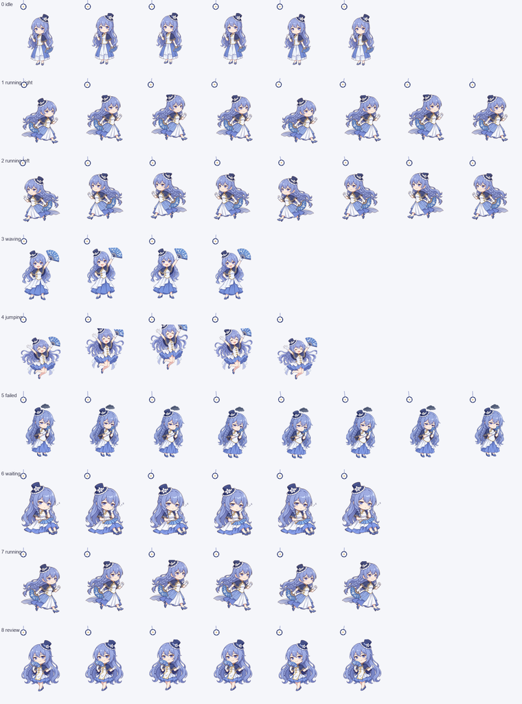

# qwen娘 桌宠

Windows 桌面上跟着 Qoder 启停的养成系桌宠。**纯本地实现，token 消耗恒为 0**——数值、感知、台词全部来自本地状态机和一份手写台词池，不联网、不调模型。



## 两种用法

**当独立桌宠（推荐，功能完整）**

```powershell
pythonw app/sentinel.pyw          # 常驻哨兵：Qoder 开→拉起她，Qoder 关→她自退
powershell -File app/install-startup.ps1   # 可选：注册开机自启
powershell -File app/uninstall-startup.ps1 # 撤销自启并结束进程
```

**当 Qoder 内置桌宠**：把 `app/assets/spritesheet.webp` 和下面这个 `pet.json` 放进
`~/.petdex/pets/qwen-chan/`，再到 Qoder 桌宠设置里刷新选择。

```json
{ "id": "qwen-chan", "displayName": "qwen娘", "spritesheetPath": "spritesheet.webp" }
```

## 生命周期怎么保证

- 启动：哨兵每 3 秒查一次 `Qoder.exe` 主窗口是否存在，存在且她没跑就拉起（命名互斥体保证哨兵只有一个）
- 退出：她自己内置看门狗，Qoder 消失超过宽限期就自毁——**崩溃和任务管理器强杀同样覆盖**
- 存活检测走 Toolhelp32 进程快照。这台机器上 `OpenProcess` 拿到的句柄不可等待（`GetExitCodeProcess` 恒失败、`WaitForSingleObject` 对活进程返回"已退出"），所以不能靠句柄探测
- 坐标全部按 DPI-aware 取。175% 缩放下不声明 DPI 会拿到虚拟化的假坐标

## 养成与"自我意识"

四项数值随真实时间衰减，离线时间也计入（回来会说"你走了 N 小时"）：

| 数值 | 影响 |
| --- | --- |
| 心情 | 低的时候拒绝被摸，动作转成沮丧态 |
| 精力 | 耗尽后倾向打瞌睡，小睡可回 |
| 亲密 | 靠摸头/喂食累积，改变说话口吻 |
| 好奇 | 掉得快，靠互动补 |

`save.json` 里还存着她的自我画像：你最活跃的钟点、最近最常碰的文件名、累计陪伴天数，
每天自动写一篇 `diary/` 日记（统计 + 模板拼装，非生成）。

**上限说清楚**：她的"知道"是前台窗口标题 + 空闲时长 + 统计查表，不是理解；台词是有限池子，几天后会开始重复。想升级只需把 `speech.py` 那层换成本地小模型，其余不用动。

## 操控

单击摸头 · 双击喂食 · 拖拽钉住 · 滚轮改大小 · 右键菜单（小睡 / 别说话 / 回到 Qoder 窗边 / 看看数值 / 写日记 / 退出）

## 参数（`app/config.json`）

`follow_qoder` 是否吸附 Qoder 窗口右下角并跟随移动 · `perch_offset` 吸附偏移 ·
`wander_range` 跑动范围 · `speech_min_gap_seconds` / `speech_max_per_hour` 说话节流 ·
`quiet_hours` 静默时段 · `watchdog_grace_seconds` 退出宽限 · `long_work_minutes` 连续工作提醒阈值

## 素材管线

```
poses/*.png  →  build_qwen_spritesheet.py  →  out/spritesheet.webp  →  app/assets/
```

精灵表 `1536×1872`：8 列 × 9 行，每格 `192×208`，行序
`idle / running-right / running-left / waving / jumping / failed / waiting / running / review`，
各行帧数 `6/8/8/4/5/8/6/6/6`，多余列透明。

姿势图用文生图逐状态生成（同一段角色描述保证一致性），再程序化补帧：去白底、
按状态自动缩放进安全框、位移/挤压/旋转做动效。两个坑写死在脚本里：

- **安全区**：Qoder 桌宠窗是 `128×176` 而格子是 `192×208`，映射方式未知，所以素材统一收进
  居中的 `128×176` 盒并让顶部留白压过 `y=32`——contain / cover / 居中裁 / 底部对齐裁四种映射都不会削头
- **键色窗口**：`-transparentcolor` 不能混合半透明像素，素材必须先放大再把 alpha 硬阈值到 0/255，
  否则轮廓外会有一圈键色描边

## 隐私

只读前台窗口标题和本地输入空闲时长，全部在本机判定，不联网、不上传、不写日志。
剪贴板默认不读（`allow_clipboard: false`）。`save.json` 含你的使用画像，已在 `.gitignore` 里。

## 版权

形象基于通义千问官方吉祥物二创，仅供个人学习与本地使用；原始参考立绘未纳入本仓库。
